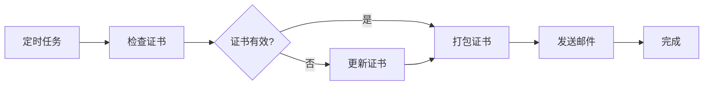

# Auto Send SSL

🔐 自动化 SSL 证书管理和邮件发送系统

[](https://opensource.org/licenses/MIT)
[](https://www.python.org/downloads/)

自动检查、更新和发送 SSL 证书到指定邮箱的轻量级 Python 工具。专为使用 Let's Encrypt (certbot) 管理证书的服务器设计。

## ✨ 功能特性

- 🔍 **智能证书检查** - 真正解析证书内容，准确获取有效期信息
- 🔄 **自动证书更新** - 检测到即将过期时自动调用 certbot 更新
- 📦 **证书打包** - 自动打包必需的证书文件（privkey.pem、fullchain.pem）
- 📧 **邮件发送** - 通过 Resend API 发送证书到指定邮箱
- 👥 **多收件人支持** - 支持配置多个收件人邮箱（逗号分隔）
- 🤖 **守护进程模式** - 支持作为守护进程运行，定期自动执行
- ⏰ **灵活调度** - 支持自定义执行间隔（天/小时/分钟/秒）
- 🧪 **测试模式** - 测试时不实际发送邮件，只打印预览
- 📝 **日志记录** - 详细的操作日志，同时输出到控制台和文件
- 🔁 **错误重试** - 关键操作支持自动重试机制
- ⚙️ **灵活配置** - 通过环境变量轻松配置所有参数

## 📋 工作流程



1. **证书检查** - 读取证书文件并解析有效期
2. **智能更新** - 如距离到期少于阈值天数，则调用 certbot 更新
3. **文件打包** - 将证书打包成 zip 格式
4. **邮件发送** - 通过 Resend 发送到配置的邮箱

## 🚀 快速开始

### 前置要求

- Python 3.8+
- certbot（如需自动更新功能）
- Resend API 密钥（[免费注册](https://resend.com)）

### 安装

1. 克隆仓库

```bash
git clone https://github.com/yourusername/auto-send-ssl.git
cd auto-send-ssl
```

2. 创建虚拟环境

```bash
python3 -m venv .venv
source .venv/bin/activate  # Windows: .venv\Scripts\activate
```

3. 安装依赖

```bash
pip install -r requirements.txt
```

4. 配置环境变量

```bash
cp .env.example .env
# 编辑 .env 文件，填入你的配置
```

### 配置说明

在 `.env` 文件中配置以下参数：

```bash
# Resend API 配置
RESEND_API_KEY=your_resend_api_key_here

# 证书域名配置
CERT_DOMAIN=example.com

# 证书路径
CERT_PATH=/etc/letsencrypt/live/example.com

# 邮件配置
FROM_EMAIL=ssl@example.com
TO_EMAIL=admin@example.com,backup@example.com  # 支持多个邮箱
SENDER_NAME=SSL Certificate System  # 可选

# 证书有效期阈值（提前多少天更新）
CERT_AGE_THRESHOLD=30

# 其他配置
LOG_LEVEL=INFO
TMP_PATH=./tmp
TEST_MODE=false         # 测试模式
DAEMON_MODE=false       # 守护进程模式
SCHEDULE_INTERVAL=1d    # 执行间隔（守护模式下生效）
CLEANUP_ZIP=false       # 是否清理 zip 文件
```

### 运行

```bash
python main.py
```

## 📖 使用示例

### 测试模式

设置 `TEST_MODE=true` 进行测试，不会实际发送邮件：

```bash
TEST_MODE=true python main.py
```

输出示例：

```
⚠️  测试模式已启用，邮件不会实际发送
============================================================
📧 测试模式 - 邮件内容预览
============================================================
主题: SSL证书自动更新 - example.com
发件人: SSL System <ssl@example.com>
收件人: admin@example.com, backup@example.com
附件: ssl_cert_example.com_20260104.zip (2428 字节)
============================================================
✓ 测试模式：邮件未实际发送（模拟发送成功）
============================================================
```

### 守护进程模式（推荐）

使用 Supervisor 管理守护进程：

```bash
# 1. 安装 Supervisor
sudo apt-get install supervisor  # Debian/Ubuntu
# 或
sudo yum install supervisor  # CentOS/RHEL

# 2. 复制配置文件
sudo cp supervisor.conf.example /etc/supervisor/conf.d/auto-send-ssl.conf

# 3. 编辑配置文件
sudo nano /etc/supervisor/conf.d/auto-send-ssl.conf
# 修改 command 和 directory 路径为实际路径

# 4. 在 .env 中启用守护模式
DAEMON_MODE=true
SCHEDULE_INTERVAL=1d  # 每天执行一次

# 5. 重新加载 Supervisor 配置
sudo supervisorctl reread
sudo supervisorctl update

# 6. 启动程序
sudo supervisorctl start auto-send-ssl

# 7. 查看状态
sudo supervisorctl status auto-send-ssl

# 8. 查看日志
sudo tail -f /var/log/supervisor/auto-send-ssl.log
```

**环境变量配置：**

```bash
# 守护模式配置
DAEMON_MODE=true              # 启用守护模式
SCHEDULE_INTERVAL=1d          # 执行间隔

# 支持的时间单位：
# d - 天   (如: 1d, 2d)
# h - 小时 (如: 12h, 24h)
# m - 分钟 (如: 30m, 60m)
# s - 秒   (如: 3600s) 仅用于测试
```

### 定时任务（Crontab）

使用 crontab 设置每天自动运行：

```bash
# 编辑 crontab
crontab -e

# 添加定时任务（每天凌晨 2 点运行）
0 2 * * * cd /path/to/auto-send-ssl && source .venv/bin/activate && python main.py >> /var/log/ssl-auto-send.log 2>&1
```

### 多个邮箱

在 `TO_EMAIL` 中使用逗号分隔多个邮箱：

```bash
TO_EMAIL=admin@example.com,backup@example.com,ops@example.com
```

## 📂 项目结构

```
auto-send-ssl/
├── main.py                  # 主程序入口
├── scheduler.py             # 调度器模块
├── get-files.py             # 证书查找和验证
├── refresh-certs.py         # 证书更新
├── zip-files.py             # 证书打包
├── sendmain.py              # 邮件发送
├── logger_config.py         # 日志配置
├── requirements.txt         # 依赖清单
├── .env.example             # 环境变量示例
├── supervisor.conf.example  # Supervisor 配置示例
└── README.md                # 项目文档
```

## 🔧 模块说明

### get-files.py

证书查找和验证模块，使用 `cryptography` 库解析证书内容。

**主要功能：**
- 检查证书文件是否存在
- 解析证书获取真实有效期
- 计算距离到期的天数

### refresh-certs.py

证书更新模块，调用 certbot 进行证书更新。

**主要功能：**
- 调用 certbot renew 命令
- 等待证书生成完成
- 支持重试机制

### zip-files.py

证书打包模块，将证书文件打包成 zip 格式。

**主要功能：**
- 打包 privkey.pem 和 fullchain.pem
- 验证 zip 文件完整性
- 自动创建输出目录

### scheduler.py

调度器模块，实现守护进程模式和定时任务。

**主要功能：**
- 解析时间间隔配置（d/h/m/s）
- 使用 APScheduler 实现定时执行
- 优雅的信号处理和关闭
- 立即执行初始任务

### sendmain.py

邮件发送模块，通过 Resend API 发送邮件。

**主要功能：**
- 支持多收件人
- 自定义发件人名称
- 测试模式支持
- 邮件发送重试

## 🛡️ 安全建议

1. **保护 .env 文件** - 不要将包含真实密钥的 `.env` 提交到 git
2. **最小权限原则** - 运行程序的用户应该只有必需的权限
3. **定期更新依赖** - 及时更新 Python 包以修复安全漏洞
4. **监控日志** - 定期检查日志文件，及时发现异常

## 🤝 贡献

欢迎提交 Issue 和 Pull Request！

1. Fork 本仓库
2. 创建特性分支 (`git checkout -b feature/AmazingFeature`)
3. 提交更改 (`git commit -m 'Add some AmazingFeature'`)
4. 推送到分支 (`git push origin feature/AmazingFeature`)
5. 开启 Pull Request

## 📄 许可证

本项目采用 MIT 许可证 - 详见 [LICENSE](LICENSE) 文件

⭐ 如果这个项目对你有帮助，请给它一个星标！
